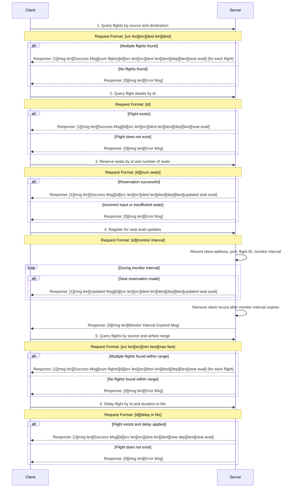

# Socket Programming Project

This project demonstrates a simple client-server application using socket programming in C++.

## Prerequisites

Ensure that you have `g++`, `gcc` and `makke` installed on your system. You can install them using the following commands:

### For Ubuntu/WSL:
```bash
sudo apt update
sudo apt install g++ gcc make
```

## Setup and Usage

### 1. Server Setup
To set up the server, follow these steps:

1. Compile and run the server:
   ```bash
   make all && ./flight_reservation_system
   ```

## Diagram


### Prepend message
- Each request/reply needs to prepend `[message_type][request_id][service_type]`

### Shortened Variable Names Explanation

1. **identifier** → `id`
2. **source** → `src`
3. **destination** → `dest`
4. **departure time in Ms** → `dep`
5. **airfare** → `fare`
6. **seat availability** → `seat avail`
7. **number of seats** → `num seats`
8. **number of flights** → `num flights`
9. **Success Message** → `Success Msg`
10. **Error Message** → `Error Msg`
11. **Updated Message** → `Updated Msg`

These abbreviations are used in the mermaid diagram to make the request and response format more concise and readable.

### Note for Request/Response Format:

- **0/1 (Success/Error)**: 1 byte (8 bits)
- **String length fields (e.g., msg len, src len, dest len)**: 32 bits (4 bytes) for each string length
- **fare**: Double-precision floating-point value (64 bits, 8 bytes)
- **id, seat avail, dep (departure time in Ms)**: 32-bit integers (4 bytes each)

This note ensures clarity for the size and format of all string length fields and other key values in the request and response structure.

## License

This project is licensed under the MIT License - see the [LICENSE](LICENSE) file for details.

## Acknowledgments

Thanks to the open-source community for providing excellent resources and documentation on socket programming in C++.
