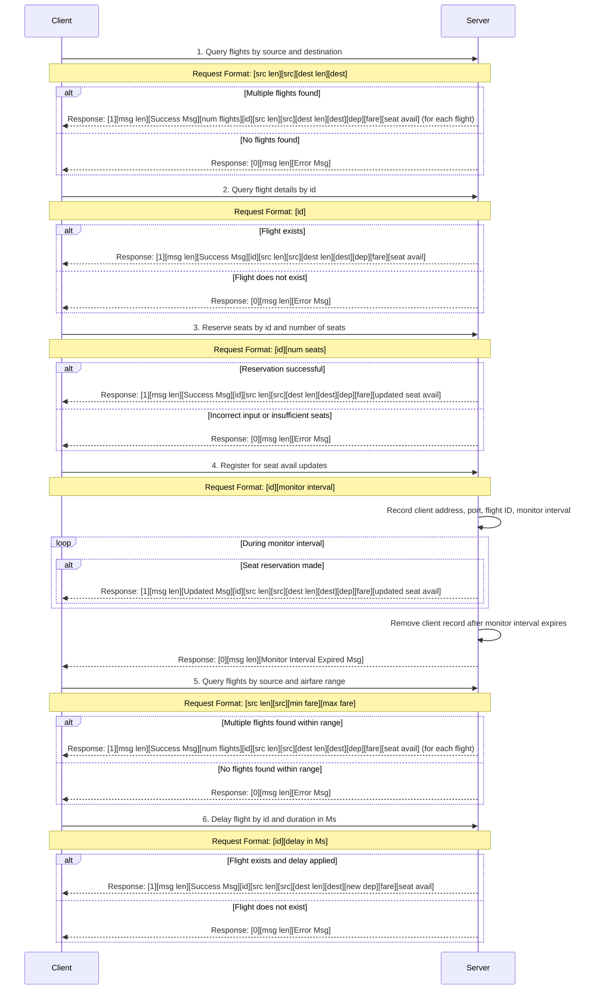

# Socket Programming Project

This project demonstrates a simple client-server application using socket programming in C++.

## Prerequisites

Ensure that you have `g++` and `gcc` installed on your system. You can install them using the following commands:

### For Ubuntu/WSL:
```bash
sudo apt update
sudo apt install g++ gcc
```

## Setup and Usage

### 1. Server Setup
To set up the server, follow these steps:

1. Compile and run the server:
   ```bash
   g++ -o build/server server.cpp && ./build/server
   ```

### 2. Client Setup
To set up the client, follow these steps:

1. Compile and run the client:
   ```bash
   g++ -o build/client client.cpp && ./build/client
   ```

2. Enter the server host:
   ```bash
   Enter server host: localhost
   ```

3. Enter the server port:
   ```bash
   Enter server port: 3000
   ```

4. Enter your name:
   ```bash
   Enter your name: John
   ```

## Diagram



### Shortened Variable Names Explanation

1. **identifier** → `id`
2. **source** → `src`
3. **destination** → `dest`
4. **departure time in Ms** → `dep`
5. **airfare** → `fare`
6. **seat availability** → `seat avail`
7. **number of seats** → `num seats`
8. **number of flights** → `num flights`
9. **Success Message** → `Success Msg`
10. **Error Message** → `Error Msg`
11. **Updated Message** → `Updated Msg`

These abbreviations are used in the mermaid diagram to make the request and response format more concise and readable.

## License

This project is licensed under the MIT License - see the [LICENSE](LICENSE) file for details.

## Acknowledgments

Thanks to the open-source community for providing excellent resources and documentation on socket programming in C++.
